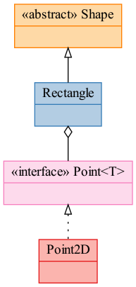

# Class Diagram plotter with Role Stereotype support

This tool takes two CSV files, each containing list of classes and list of relationship between the classes, and plots a corresponding UML Class Diagram.

## Requirements

- Python (I use 3.9.5, other versions are untested)
- [Graphviz](graphviz.org)

## Input files format and examples

The classes CSV contains a header line and rows of class name, class abstraction type, and class role stereotype (consult [Rebecca Wirf-Brock's Object Design](http://www.wirfs-brock.com/DesignBooks.html) for more info on role stereotypes). This is an example:

| Class Name | Abstraction | Role Stereotype    |
|------------|-------------|--------------------|
| Point<T>   | interface   | Structurer         |
| Point2D    |             | Information Holder |
| Rectangle  |             | Service Provider   |
| Shape      | abstract    | Interfacer         |

(See `sample_members.csv`)

The relationships CSV contains a header line and rows of relationship name, participant A, and participant B. Accepted relationship names are: "inherits", "realizes", "aggregates", "composites", and "associates". The names are slightly different from the terms used in UML standard so that it is readable, e.g., "inherits, Rectangle, Shape" --> "Rectangle inherits Shape". This is an example:

| Relationship | Participant A | Participant B |
|--------------|---------------|---------------|
| realizes     | Point2D       | Point<T>      |
| composites   | Rectangle     | Point<T>      |
| inherits     | Rectangle     | Shape         |

(See `sample connections.csv`)

These input files will generate the following class diagram:



## Usage

For use within a Jupyter notebook, consult `classdiagram-demo.ipynb`.

For use as a command line tool, assuming the use of `python` command:

```python
$ ./python classdiagram.py <classes-csv> <relationships-csv> <output-filename>
```

Output file name can be in any format supported by Graphviz, e.g., PNG or SVG.

Here is an example:

```python
$ ./python classdiagram.py sample_members.csv sample_connections.csv output.png
```

